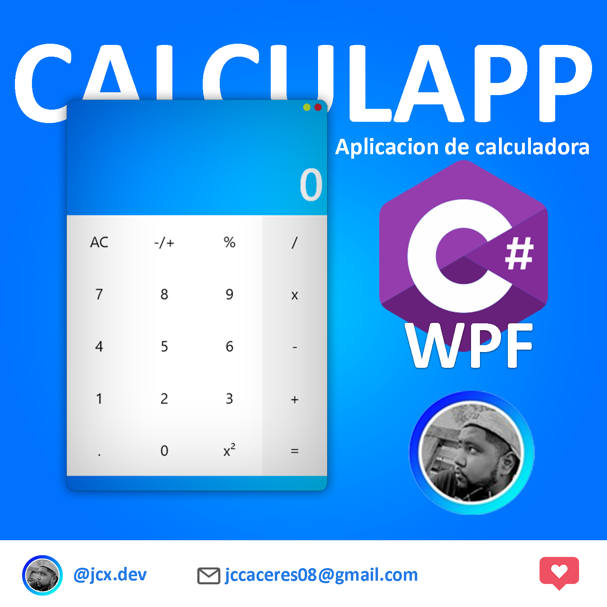
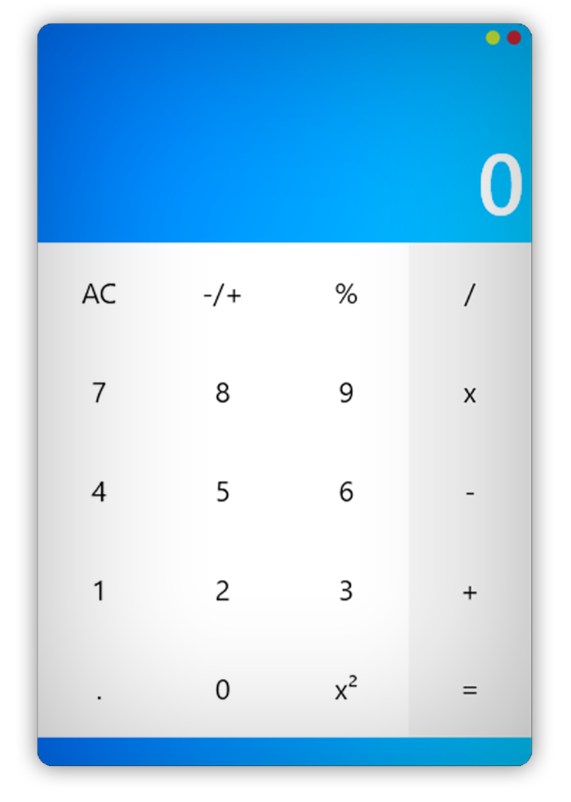

# CalculApp
## Calculadora para MS Windows construida en C Sharp WPF (práctica). 
 

 
<b> Es una calculadora simple, realiza operaciones básicas de aritmetica, nada complicado.</b>
 
 

 
El archivo que contiene el codigo para el diseño de la interfaz gráfica es: MainWindows.xaml.
 
El otro archivo importante es el de la lógica de las operaciones, estas están en el archivo: MainWindows.xaml.cs.
